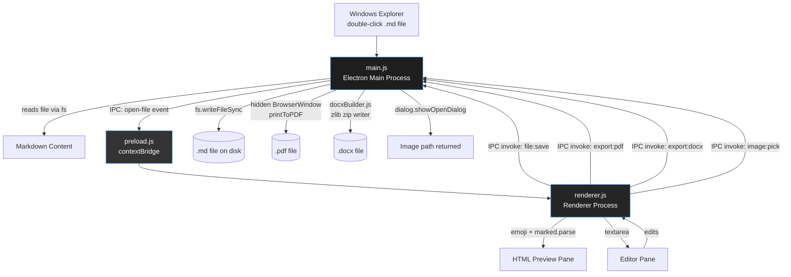
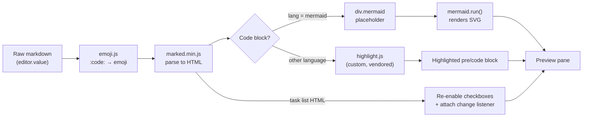
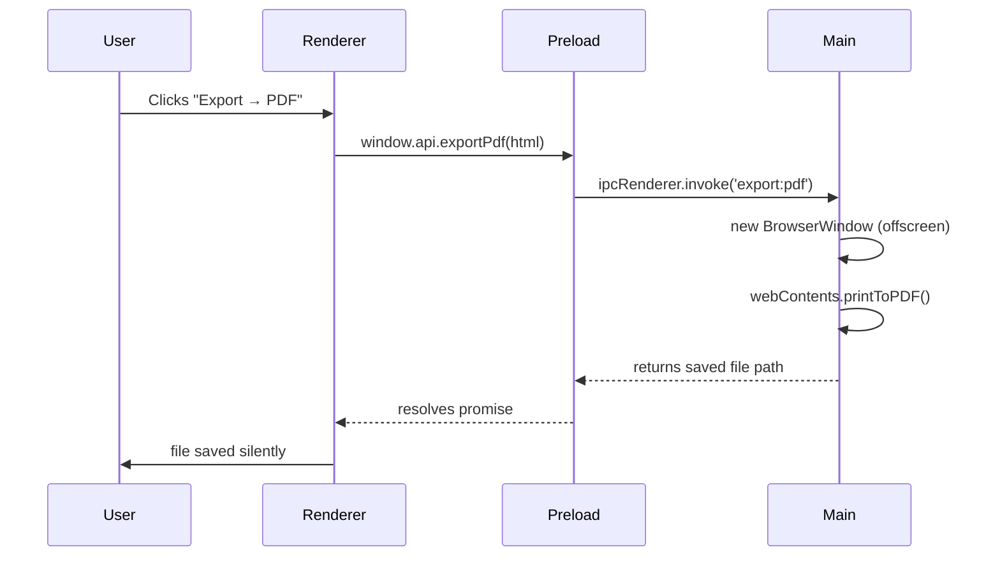
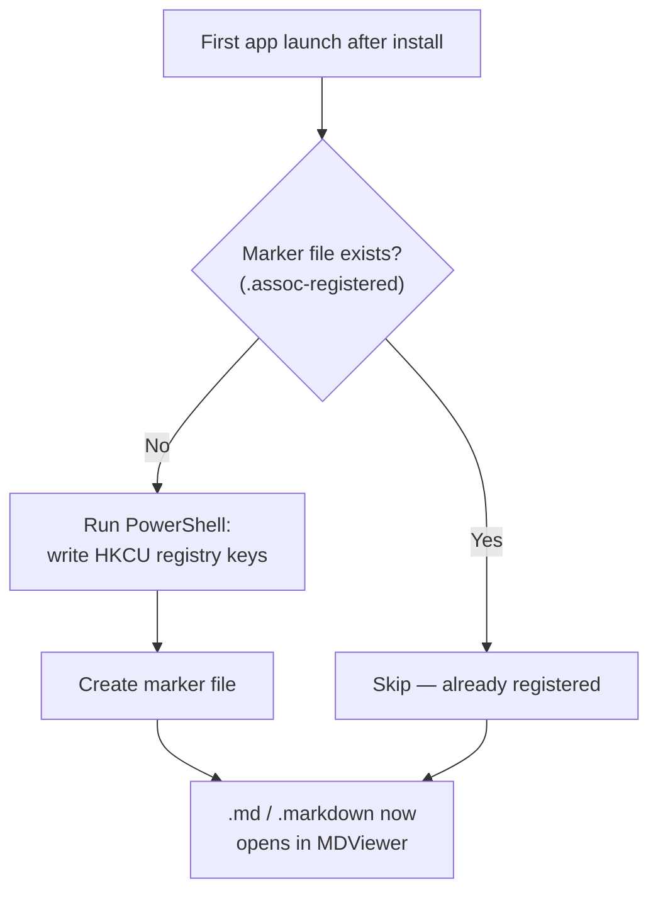
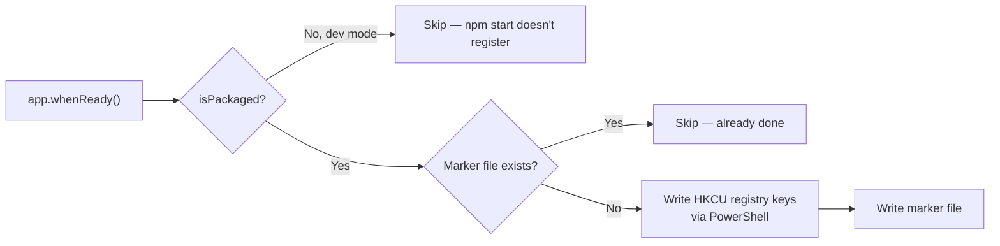

# MDViewer

A lightweight, fully **offline** Markdown viewer and editor for Windows, built with Electron and Chromium. No telemetry, no network calls, no heavyweight frameworks. Open this file *inside MDViewer itself* once it's built — the diagrams below will render as real flowcharts, the code blocks will be syntax highlighted, and `:rocket:` will turn into an emoji.

---

## Table of Contents

1. [Overview](#overview)
2. [Features](#features)
3. [Architecture](#architecture)
4. [Tech Stack](#tech-stack)
5. [Project Structure](#project-structure)
6. [Complete Run Guide](#complete-run-guide)
7. [All Commands Reference](#all-commands-reference)
8. [Troubleshooting](#troubleshooting)
9. [Export Formats](#export-formats)
10. [Feature Test Snippet](#feature-test-snippet)
11. [File Association Details](#file-association-details)
12. [Why It's Lightweight](#why-its-lightweight)
13. [Roadmap](#roadmap)

---

## Overview

MDViewer is a **minimal**, **fast**, locally-run desktop app for viewing and editing Markdown files on Windows. It registers itself as the default handler for `.md` and `.markdown` files, so double-clicking any markdown file on your system opens it directly in the app — no browser, no cloud account, no internet connection required at any point.

The guiding principle: **zero unnecessary dependencies**. Markdown parsing, syntax highlighting, PDF export, and DOCX export each either use a single small vendored file or Node/Electron's own built-in APIs. The one exception is Mermaid (for diagram rendering), which is a larger vendored bundle because diagrams genuinely need a real layout engine — but it's still bundled locally, not loaded from a CDN.

> "The fastest code is the code you don't ship." — every dependency was considered before being added.

---

## Features

- [x] Split-pane live editor + preview, toggleable between `Split` / `Editor` / `Preview`
- [x] Open and save `.md` / `.markdown` files
- [x] **Double-click a `.md` file in Explorer → opens directly in this app**
- [x] Export to **HTML**, **PDF**, **Word (.docx)**, and plain **.txt**
- [x] Single-instance window — opening another file reuses the same window
- [x] **Mermaid diagrams** — fenced ` ```mermaid ` blocks render as real flowcharts, sequence diagrams, etc.
- [x] **Syntax highlighting** in fenced code blocks: JS, TS, Python, Bash, JSON, HTML, CSS, YAML, Java, C/C++/C#, Go, Rust, SQL, PHP, Ruby, Dockerfile, and more
- [x] **Emoji shortcodes** — `:smile:`, `:rocket:`, `:fire:`, `:tada:`, etc. render as real emoji
- [x] **Interactive task-list checkboxes** — clicking one in the preview updates the raw markdown source automatically
- [x] **Image insertion** three ways: toolbar button (file picker), drag-and-drop from Explorer, or paste a clipboard screenshot
- [x] Windows installer (`.msi`) with Desktop shortcut, Start Menu entry, and proper uninstall support
- [x] Portable `.exe` build with no installation required

### Keyboard Shortcuts

| Shortcut | Action |
|---|---|
| `Ctrl + O` | Open file |
| `Ctrl + S` | Save file |

---

## Architecture

MDViewer follows Electron's standard **two-process model**: a privileged *main* process (full Node.js + OS access) and a sandboxed *renderer* process (Chromium, UI only), connected through a `contextBridge` preload script so the UI never has direct filesystem access.



### Process Responsibilities

| Process | Responsibilities | Node.js access? |
|---|---|---|
| **Main** (`main.js`) | Window lifecycle, file I/O, dialogs, PDF/DOCX export, Windows registry file association, image save | ✅ Full |
| **Preload** (`preload.js`) | Exposes a minimal, safe `window.api` surface via `contextBridge` — the *only* bridge between renderer and main | ⚠️ Bridge only |
| **Renderer** (`renderer.js`) | Markdown parsing, live preview, Mermaid rendering, syntax highlighting, emoji substitution, checkbox interactivity, UI events | ❌ Sandboxed, no direct access |

### Rendering Pipeline (inside the renderer process)



### IPC Contract (Export Example)



### File Association Flow (Windows)



---

## Tech Stack

| Layer | Choice | Why |
|---|---|---|
| Shell | Electron 31 | Native window + Chromium renderer in one package |
| Markdown parsing | `marked` (vendored UMD bundle) | Small, fast, zero runtime dependency tree, GFM enabled |
| Diagrams | `mermaid` (vendored UMD bundle) | The only realistic option for real diagram layout — no custom engine makes sense to hand-roll |
| Syntax highlighting | Custom hand-written highlighter (`highlight.js` in this repo, **not** the npm package of the same name) | Avoids pulling in a multi-MB language-grammar bundle for a feature most code blocks barely need |
| Emoji | Static lookup table (`emoji.js`) | No dependency needed for ~100 common shortcodes |
| PDF export | Chromium's built-in `printToPDF` | Already shipped with Electron — zero extra dependency |
| DOCX export | Hand-rolled OOXML + Node's `zlib` | Avoids a 10+ MB docx library for a small feature |
| Installer | `electron-builder` → WiX MSI (auto-downloaded at build time) | Standard Windows installer experience |
| UI | Plain HTML/CSS/JS | No framework overhead for a single-screen app |

---

## Project Structure

```text
mdviewer/
├── src/
│   ├── main.js                      # Electron main process
│   ├── preload.js                   # contextBridge — safe API surface
│   ├── docxBuilder.js               # Dependency-free .docx (OOXML) writer
│   ├── index.html                   # App shell (toolbar + editor + preview)
│   ├── style.css                    # Dark theme + syntax/mermaid/checkbox styling
│   ├── renderer.js                  # Editor/preview logic, exports, image insert
│   ├── marked.min.js                # Vendored markdown parser (GFM, offline)
│   ├── highlight.js                 # Custom dependency-free syntax highlighter
│   ├── emoji.js                     # Emoji shortcode lookup table
│   ├── mermaid.min.js               # Vendored Mermaid diagram renderer
│   └── icon.png                     # Runtime window icon
├── build/
│   ├── icon.ico                     # Multi-resolution Windows icon (build-time)
│   └── icon.png
├── register-file-association.ps1    # Manual fallback registry script
├── package.json                     # electron-builder config (MSI + portable)
└── README.md                        # This file
```

---

## Complete Run Guide

Run every command below inside a terminal **opened in the `mdviewer` project folder**.

### Step 0 — Prerequisites

Install **Node.js LTS** from [nodejs.org](https://nodejs.org) if you don't already have it. This gives you both `node` and `npm`.

```bash
node -v
npm -v
```

Both should print a version number. If `node -v` fails, Node.js isn't installed or isn't on your `PATH` — reinstall and restart your terminal.

### Step 1 — Install dependencies

```bash
npm install
```

### Step 2 — Allow install scripts (one-time, if prompted)

Modern npm blocks native install scripts by default (used by `electron` and `electron-winstaller` to fetch their binaries). You may see:

```text
npm warn allow-scripts 1 package has install scripts not yet covered by allowScripts:
  electron@31.7.7 (install: (install scripts present))
```

The blocked package name can differ between installs. The reliable, one-time fix:

```bash
npm config set allowScripts true
npm install
npm approve-scripts electron
```

See [Troubleshooting](#troubleshooting) below for alternatives if this doesn't resolve it.

### Step 3 — Run in development mode (optional, to test before building)

```bash
npm start
```

This launches the app directly via Electron without packaging anything — useful for quickly checking changes.

### Step 4 — Build the Windows app

```bash
npm run dist
```

This single command (via `electron-builder`):
- Downloads Electron's prebuilt binaries (first run only)
- Downloads the WiX Toolset automatically (first run only, build-time only)
- Packages the app and produces two files in `bin/`

| File | What it is |
|---|---|
| `bin/MDViewer 1.0.0.msi` | **Standard installer** — installs the app, adds Desktop + Start Menu shortcuts, registers `.md`/`.markdown` files, adds a normal uninstall entry |
| `bin/MDViewer.exe` | **Portable** version — single file, no install, runs from anywhere (USB stick, any folder) |

### Step 5 — Install the app

```bash
bin\MDViewer 1.0.0.msi
```

Or just double-click the `.msi` file in File Explorer. Click through the installer (Next → Install → Finish) — no admin password needed, it installs per-user.

### Step 6 — Verify

- **Desktop** → look for the **MDViewer** shortcut
- **Start Menu** → search "MDViewer"
- Double-click any `.md` file anywhere on your PC → it should open directly in MDViewer

### Step 7 — Clean up (optional)

Once installed, you can delete the entire project folder — including `node_modules` and any WiX cache. The installed app is fully standalone and does **not** depend on Node.js, npm, or WiX at runtime.

---

## All Commands Reference

| Command | What it does |
|---|---|
| `node -v` | Check Node.js is installed |
| `npm -v` | Check npm is installed |
| `npm install` | Install all project dependencies |
| `npm config set allowScripts true` | Allow native install scripts project-wide (fixes the approve-scripts prompt) |
| `npm approve-scripts <name>` | Approve a specific blocked package by name (no version number) |
| `npm approve-scripts --allow-scripts-pending` | List which package(s) are currently pending approval |
| `npm config set ignore-scripts false` | Alternative fallback to allow install scripts |
| `npm start` | Run the app directly in development mode (no packaging) |
| `npm run dist` | Build the Windows installer (`.msi`) and portable (`.exe`) |
| `bin\MDViewer 1.0.0.msi` | Run/install the built MSI from the terminal |
| `rmdir /s /q node_modules` | (Windows) Delete `node_modules` for a clean reinstall |
| `del package-lock.json` | (Windows) Delete the lockfile for a clean reinstall |

---

## Troubleshooting

### "package has install scripts not yet covered by allowScripts"

This is npm's install-script approval gate. The blocked package name can vary between runs (`electron`, `electron-winstaller`, etc.) so approving one at a time can repeat. Fix it once, project-wide:

```bash
npm config set allowScripts true
npm install
```

Alternative — approve the exact package named in the warning:

```bash
npm approve-scripts electron
```

If neither works, fall back to:

```bash
npm config set ignore-scripts false
npm install
```

### MSI build fails with a WiX/icon error (`LGHT0094`, `Icon could not be found`)

This means `build/icon.ico` is missing or not referenced correctly in `package.json`. Confirm `package.json` has:

```json
"win": { "icon": "build/icon.ico" }
```

and that `build/icon.ico` exists in the project folder. (Already included in this repo.)

### MSI build warns "Manufacturer is not set for MSI"

Add or check the `"author"` field in `package.json`:

```json
"author": "MDViewer"
```

(Already included in this repo.)

### A `.md` file still opens in another app after installing

Right-click the file → **Open with** → **Choose another app** → select **MDViewer** → check **"Always use this app"**.

Or run the included fallback script: right-click `register-file-association.ps1` → **Run with PowerShell** (must be in the same folder as `MDViewer.exe`).

### Want a fully clean reinstall

```bash
rmdir /s /q node_modules
del package-lock.json
npm install
npm run dist
```

---

## Export Formats

```js
// Simplified export dispatcher from renderer.js
async function exportAs(format) {
  switch (format) {
    case 'html': return saveHtml(preview.innerHTML);
    case 'pdf':  return window.api.exportPdf({ html: fullHtml });
    case 'docx': return window.api.exportDocx({ paragraphs });
    case 'txt':  return saveText(preview.innerText);
  }
}
```

| Format | How it's built |
|---|---|
| **HTML** | Full standalone document with inline `<style>` — opens in any browser |
| **PDF** | Rendered via Chromium's print engine (`printBackground: true`) |
| **DOCX** | Minimal but valid OOXML package — headings, bold, lists, tables |
| **TXT** | Plain extracted text, all formatting stripped |

---

## Feature Test Snippet

Paste this into the editor to exercise every feature at once:

````markdown
Great job team :tada: :fire:

- [x] Wire up Mermaid
- [ ] Add more languages to the highlighter

```js
function add(a, b) {
  return a + b; // syntax highlighted
}
```


| Feature | Status |
|---|---|
| Diagrams | ✅ |
| Highlighting | ✅ |
| Emoji | ✅ |
````

Click the checkbox in the **preview pane** — it should flip to checked and update the raw markdown in the editor automatically.

To test image insertion: click **Insert Image** in the toolbar and pick any picture file, or just drag an image from Explorer straight into the editor pane, or copy a screenshot and paste it (`Ctrl+V`) while the editor is focused.

---

## File Association Details

Whichever build you install, MDViewer self-registers as the `.md`/`.markdown` handler **the first time it launches** — writing to `HKCU` (per-user registry, no admin prompt) as a safety net in addition to whatever the MSI installer itself sets up. A marker file prevents it from re-running this on every launch.



If it's ever overridden by another app later:
1. Right-click a `.md` file → **Open with** → **Choose another app** → select MDViewer → check "Always use this app"
2. Or run `register-file-association.ps1` from the same folder as `MDViewer.exe`

---

## Why It's Lightweight

- No frontend framework, no bundler — plain HTML/CSS/JS
- Markdown parsing: one small vendored library file (`marked.min.js`)
- Syntax highlighting: a hand-written ~3KB highlighter instead of a full language-grammar bundle
- Emoji: a static lookup table, no dependency
- PDF export: Chromium's built-in `printToPDF` — zero extra dependency
- DOCX export: hand-rolled OOXML writer using Node's built-in `zlib` — zero extra dependency
- `asar` packaging + maximum compression keep the final installer small
- Mermaid is the one larger vendored file (~3.3MB minified) because diagram layout genuinely needs a real engine — still fully offline, no CDN, bundled once at build time

---

## Roadmap

- [ ] Light theme + theme toggle persisted across sessions
- [ ] Recent files list
- [ ] Auto-save with debounce
- [ ] Find & replace
- [ ] More highlighter languages (Kotlin, Swift, Scala)

---

*Last updated: June 2026 — maintained as a personal local-first tool: no telemetry, no analytics, no update server.*
