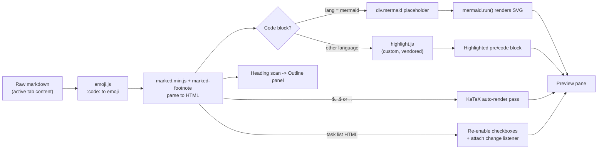
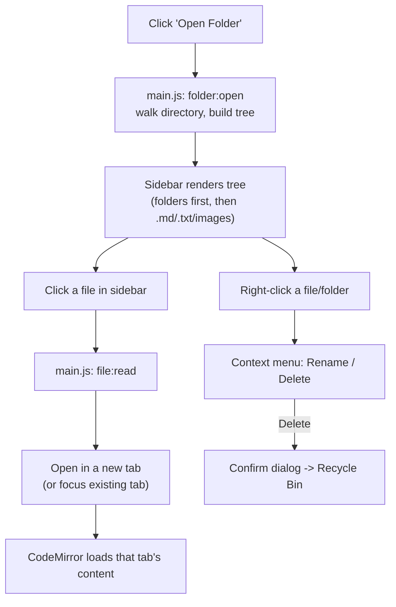

# MDViewer

A lightweight, fully **offline** Markdown editor and viewer for Windows — built with Electron and Chromium. No telemetry, no network calls, no cloud account. Now with multi-file project support, a real code editor, math rendering, and diagrams: a local-first, lightweight take on an "Overleaf for Markdown" experience.

---

## Table of Contents

1. [Overview](#overview)
2. [Features](#features)
3. [Architecture](#architecture)
4. [Tech Stack](#tech-stack)
5. [Project Structure](#project-structure)
6. [Complete Run Guide](#complete-run-guide)
7. [All Commands Reference](#all-commands-reference)
8. [Troubleshooting](#troubleshooting)
9. [Export Formats](#export-formats)
10. [Feature Test Snippet](#feature-test-snippet)
11. [File Association Details](#file-association-details)
12. [Why It's Lightweight](#why-its-lightweight)
13. [Known Limitations](#known-limitations)

---

## Overview

MDViewer is a **local-first** markdown workspace: open a single file, or open an entire folder as a project with a file tree sidebar, multiple tabs, and an outline panel — all without an internet connection at any point. Every feature ships as a vendored local file; nothing is fetched from a CDN, including in exported HTML.

> Every dependency was weighed against the cost of bundling vs. the value of the feature. The result favors small, focused libraries over heavyweight frameworks.

---

## Features

### Editing
- [x] Real code-editor experience (CodeMirror) — not a plain textarea
- [x] Markdown-aware syntax coloring **in the editor itself** (headings, links, emphasis, code spans)
- [x] Find & Replace (`Ctrl+F` / `Ctrl+H`)
- [x] Smart list continuation (pressing Enter inside a `-`/`1.` list continues it)
- [x] Active-line highlighting

### Navigation & Organization
- [x] **Open a folder as a project** — file tree sidebar showing `.md`, `.txt`, and image files
- [x] **Tabs** — multiple files open at once, switch between them, unsaved-state dot indicator
- [x] Create / rename / delete files and folders from the sidebar (delete goes to Recycle Bin, not permanent)
- [x] Outline panel — clickable table of contents generated from your headings, jumps to that section
- [x] Active file highlighted in the sidebar

### Rendering Completeness
- [x] **Mermaid diagrams** — fenced ` ```mermaid ` blocks render as real flowcharts/sequence diagrams
- [x] **Math rendering** — `$inline$` and `$$display$$` LaTeX via KaTeX
- [x] **Footnotes** — `[^1]` reference syntax renders a proper footnotes section
- [x] Syntax highlighting in fenced code blocks (JS, TS, Python, Bash, JSON, HTML, CSS, YAML, Java, C/C++/C#, Go, Rust, SQL, PHP, Ruby, Dockerfile, and more)
- [x] Emoji shortcodes (`:fire:`, `:rocket:`, etc.)
- [x] Interactive task-list checkboxes that sync back to the raw markdown
- [x] Tables, blockquotes, nested lists — full GFM support

### Polish
- [x] **Light and dark theme toggle** — affects the whole app, including the code editor itself
- [x] Unsaved-changes warning before closing the app or a tab
- [x] External links open in your real default browser, never inside the app
- [x] Image insertion three ways: toolbar picker, drag-and-drop, clipboard paste
- [x] Windows installer (`.msi`) with Desktop shortcut, Start Menu entry, proper uninstall
- [x] Portable `.exe` build, no install required
- [x] PDF export plus a separate **print-preview** export option for more control before saving

### Export Formats
- [x] HTML (standalone, includes inlined KaTeX CSS — works fully offline, no CDN)
- [x] PDF (direct save, or via print-preview dialog)
- [x] Word (`.docx`)
- [x] Plain text (`.txt`)

### Keyboard Shortcuts

| Shortcut | Action |
|---|---|
| `Ctrl + O` | Open file |
| `Ctrl + S` | Save file |
| `Ctrl + F` | Find |
| `Ctrl + H` | Find & Replace |

---

## Architecture

Two-process Electron model: a privileged **main** process (Node.js, full OS access) and a sandboxed **renderer** process (Chromium, UI only), connected through a `contextBridge` preload script — the renderer never touches the filesystem directly.

```mermaid
flowchart TD
    A["Windows Explorer<br/>double-click .md, or Open Folder"] --> B["main.js<br/>Electron Main Process"]
    B -->|fs.readFileSync / readdir| C["File or folder tree"]
    B -->|"IPC: open-file / folder:open"| D["preload.js<br/>contextBridge"]
    D --> E["renderer.js<br/>Renderer Process"]
    E --> F["CodeMirror editor<br/>(one Doc per tab)"]
    E -->|emoji + footnotes + marked.parse| G["HTML Preview Pane"]
    G --> H["Mermaid render pass"]
    G --> I["KaTeX math render pass"]
    G --> J["Custom syntax highlighter<br/>for fenced code"]

    F -->|edits| E
    E -->|"IPC: file:save"| B
    B -->|fs.writeFileSync| K[(".md file on disk")]

    E -->|"IPC: export:pdf / export:docx"| B
    B -->|"printToPDF / docxBuilder.js"| L[("PDF / DOCX file")]

    style B fill:#1e1e1e,stroke:#4fa3ff,color:#fff
    style E fill:#252526,stroke:#4fa3ff,color:#fff
    style D fill:#333,stroke:#4fa3ff,color:#fff
```



### Process Responsibilities

| Process | Responsibilities | Node.js access? |
|---|---|---|
| **Main** (`main.js`) | Window lifecycle, file/folder I/O, dialogs, PDF/DOCX export, registry file association, image save, unsaved-changes-on-close gate, external link redirection | ✅ Full |
| **Preload** (`preload.js`) | Exposes a minimal, explicit `window.api` surface via `contextBridge` — the only bridge between renderer and main | ⚠️ Bridge only |
| **Renderer** (`renderer.js`) | CodeMirror editor, tab/document state, file tree UI, markdown rendering pipeline (emoji → marked → mermaid/katex/highlight passes), outline, theme | ❌ Sandboxed, no direct access |

### Rendering Pipeline (inside the renderer process)



### Multi-File Project Flow



---

## Tech Stack

| Layer | Choice | Why |
|---|---|---|
| Shell | Electron 31 | Native window + Chromium renderer in one package |
| Code editor | CodeMirror 5 (vendored) | The one real dependency added for in-editor syntax coloring, find/replace, and list continuation — adding it directly addresses the editing-experience gap vs. a plain textarea |
| Markdown parsing | `marked` (vendored UMD bundle) | Small, fast, GFM enabled |
| Footnotes | `marked-footnote` (vendored) | Small extension, adds `[^1]` support without touching core parsing |
| Diagrams | `mermaid` (vendored UMD bundle) | The only realistic option for real diagram layout |
| Math | `katex` + `auto-render` (vendored) | Fast, designed for exactly this DOM-scan-and-replace use case |
| Syntax highlighting (preview) | Custom hand-written highlighter (`highlight.js` in this repo, **not** the npm package) | Avoids a multi-MB language-grammar bundle |
| Emoji | Static lookup table (`emoji.js`) | No dependency needed for ~100 common shortcodes |
| PDF export | Chromium's built-in `printToPDF` | Already shipped with Electron |
| DOCX export | Hand-rolled OOXML + Node's `zlib` | Avoids a 10+ MB docx library |
| Installer | `electron-builder` → WiX MSI (auto-downloaded at build time) | Standard Windows installer experience |
| UI | Plain HTML/CSS/JS | No frontend framework overhead |

---

## Project Structure

```text
mdviewer/
├── src/
│   ├── main.js                      # Electron main process
│   ├── preload.js                   # contextBridge — safe API surface
│   ├── docxBuilder.js               # Dependency-free .docx (OOXML) writer
│   ├── index.html                   # App shell (toolbar, sidebar, tabs, editor, preview, outline, modal)
│   ├── style.css                    # Dark + light theme, full UI styling, CodeMirror overrides
│   ├── renderer.js                  # Editor/tabs/sidebar logic, rendering pipeline, exports
│   ├── marked.min.js                # Vendored markdown parser (GFM, offline)
│   ├── marked-footnote.min.js       # Vendored footnote extension for marked
│   ├── highlight.js                 # Custom dependency-free syntax highlighter (preview pane)
│   ├── emoji.js                     # Emoji shortcode lookup table
│   ├── mermaid.min.js               # Vendored Mermaid diagram renderer
│   ├── codemirror/                  # Vendored CodeMirror 5 + language modes + search/dialog addons
│   ├── katex/                       # Vendored KaTeX + auto-render + fonts
│   └── icon.png                     # Runtime window icon
├── build/
│   ├── icon.ico                     # Multi-resolution Windows icon (build-time)
│   └── icon.png
├── register-file-association.ps1    # Manual fallback registry script
├── package.json                     # electron-builder config (MSI + portable)
└── README.md                        # This file
```

---

## Complete Run Guide

Run every command inside a terminal **opened in the `mdviewer` project folder**.

### Step 0 — Prerequisites

Install **Node.js LTS** from [nodejs.org](https://nodejs.org) if you don't have it.

```bash
node -v
npm -v
```

### Step 1 — Install dependencies

```bash
npm install
```

### Step 2 — Allow install scripts (one-time, if prompted)

```bash
npm config set allowScripts true
npm install
```

See [Troubleshooting](#troubleshooting) if this doesn't resolve a prompt.

### Step 3 — Run in development mode (optional)

```bash
npm start
```

### Step 4 — Build the Windows app

```bash
npm run dist
```

Produces, in `bin/`:

| File | What it is |
|---|---|
| `MDViewer 1.1.0.msi` | Standard installer — Desktop + Start Menu shortcuts, file association, uninstall entry |
| `MDViewer.exe` | Portable, no-install version |

### Step 5 — Install

Double-click `bin/MDViewer 1.1.0.msi`. No admin rights needed — installs per-user.

### Step 6 — Verify

- Desktop shortcut and Start Menu entry exist
- Double-clicking a `.md` file opens it in MDViewer
- Click **Open Folder** in the toolbar, pick any folder with markdown files — a file tree should appear in the sidebar

### Step 7 — Clean up (optional)

Delete the project folder, `node_modules`, and any WiX cache once installed — the app is fully standalone afterward.

---

## All Commands Reference

| Command | What it does |
|---|---|
| `node -v` / `npm -v` | Check Node.js / npm are installed |
| `npm install` | Install all project dependencies |
| `npm config set allowScripts true` | Allow native install scripts project-wide |
| `npm approve-scripts <name>` | Approve one specific blocked package by name |
| `npm config set ignore-scripts false` | Alternative fallback to allow install scripts |
| `npm start` | Run the app in development mode (no packaging) |
| `npm run dist` | Build the Windows installer (`.msi`) and portable (`.exe`) |
| `rmdir /s /q node_modules` | (Windows) Delete `node_modules` for a clean reinstall |
| `del package-lock.json` | (Windows) Delete the lockfile for a clean reinstall |

---

## Troubleshooting

### "package has install scripts not yet covered by allowScripts"

```bash
npm config set allowScripts true
npm install
```

If that doesn't help, try approving the specific package named in the warning:

```bash
npm approve-scripts electron
```

### MSI build fails with a WiX/icon error

Confirm `package.json` has `"win": { "icon": "build/icon.ico" }` and that `build/icon.ico` exists (it's included in this repo).

### A `.md` file still opens in another app after installing

Right-click the file → **Open with** → **Choose another app** → select **MDViewer** → check "Always use this app". Or run `register-file-association.ps1` (right-click → Run with PowerShell) from the same folder as `MDViewer.exe`.

### Clicking a link inside a markdown file opens it inside MDViewer instead of my browser

This was a real bug, already fixed — `main.js` now intercepts external navigation and hands it to your OS default browser via `shell.openExternal`. If you still see this, make sure you're on the latest build (`npm run dist` again after pulling the latest `main.js`).

### Images don't show up

Relative image paths (``) are resolved against the folder of the currently **open and saved** file. If the document has never been saved, there's no folder to anchor to yet — save once, then relative images will resolve. Absolute paths (`C:/Users/.../pic.png`, using forward slashes) always work regardless.

### Want a fully clean reinstall

```bash
rmdir /s /q node_modules
del package-lock.json
npm install
npm run dist
```

---

## Export Formats

| Format | How it's built |
|---|---|
| **HTML** | Standalone document with KaTeX CSS inlined locally (no CDN) — opens correctly offline in any browser |
| **PDF** | Direct save via Chromium's `printToPDF`, or the **print-preview** option for manual control (margins, page range) before saving |
| **DOCX** | Minimal but valid OOXML package — headings, bold, lists, tables |
| **TXT** | Plain extracted text, formatting stripped |

---

## Feature Test Snippet

```markdown
Great job team :tada: :fire:

- [x] Wire up Mermaid
- [ ] Try math rendering

```js
function add(a, b) {
  return a + b; // syntax highlighted
}
```


Inline math: $E = mc^2$

Display math:

$$\int_0^\infty e^{-x} dx = 1$$

A footnote reference[^1].

[^1]: Footnotes render as a proper numbered section at the bottom.
```

Click the unchecked box in the preview — it should flip to checked and update the raw markdown automatically. Open a folder with several `.md` files to see the sidebar and tabs in action.

---

## File Association Details

MDViewer self-registers as the `.md`/`.markdown` handler on first launch — writing to `HKCU` (per-user, no admin prompt) as a safety net in addition to whatever the MSI itself sets up. A marker file prevents re-running this on every launch.

If it's ever overridden by another app:
1. Right-click a `.md` file → **Open with** → **Choose another app** → select MDViewer → "Always use this app"
2. Or run `register-file-association.ps1` from the same folder as `MDViewer.exe`

---

## Why It's Lightweight

- No frontend framework, no bundler — plain HTML/CSS/JS, vendored libraries loaded as plain `<script>` tags
- CodeMirror 5 was chosen over CodeMirror 6 / Monaco specifically for its smaller footprint while still delivering real in-editor syntax coloring and search
- Syntax highlighting in the **preview pane** uses a hand-written ~3KB highlighter instead of a full grammar-bundle library
- Emoji: a static lookup table, no dependency
- PDF export: Chromium's built-in `printToPDF` — zero extra dependency
- DOCX export: hand-rolled OOXML writer using Node's built-in `zlib` — zero extra dependency
- `asar` packaging + maximum compression keep the final installer as small as the included libraries allow
- Mermaid (~3.3MB) and KaTeX (~600KB incl. fonts) are the two larger vendored pieces — both are things that genuinely need a real engine, and both are still fully offline, no CDN, bundled once at build time

---

## Known Limitations

Honest gaps versus a full IDE-style tool (Obsidian/Typora-class):

- No WYSIWYG "hide the markdown symbols" editing mode — this stays a raw-markdown + rendered-preview split, intentionally, to keep things simple and predictable
- No wiki-style `[[backlinks]]` between notes, no global cross-file search
- No real-time collaboration or cloud sync (by design — this is a local-first tool)
- No git integration or version history
- Emoji set (~100 shortcodes) is curated, not the full GitHub set (~1800)
- Exported HTML inlines KaTeX's CSS but not its font files (to avoid bloating every exported file) — math layout and sizing is correct even fully offline, but glyph rendering may fall back to system fonts in some edge cases when the exported HTML is viewed with zero internet access

---

*Last updated: June 2026 — maintained as a personal local-first tool: no telemetry, no analytics, no update server.*
